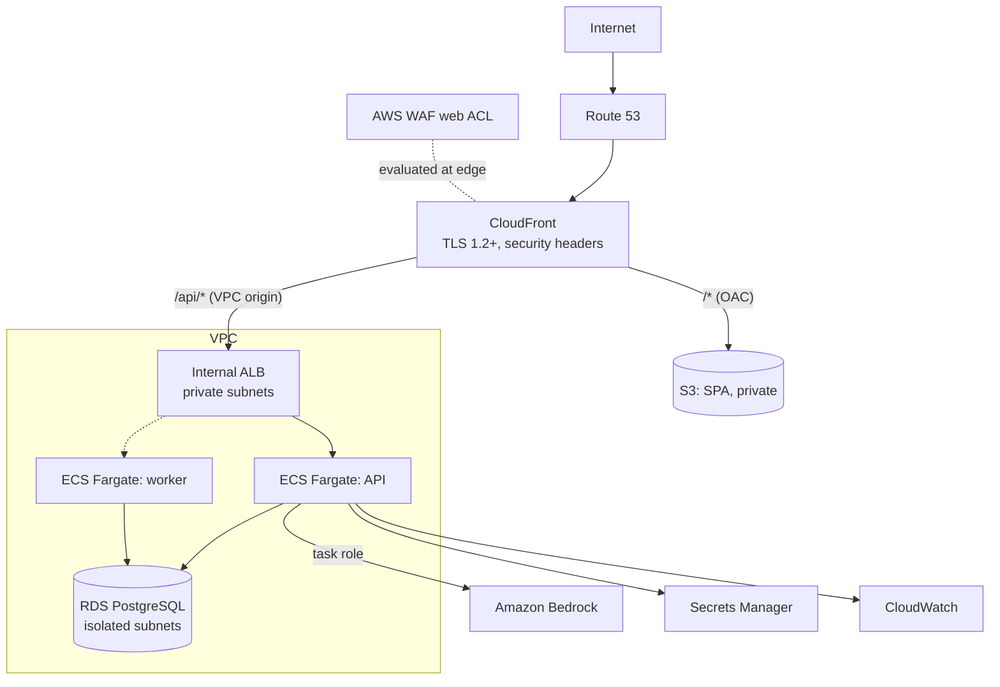

# SentinelEdge

An AI-assisted application, API, and edge security platform, built to show how an internet-facing,
AI-enabled application is designed, secured, deployed, monitored, and governed on AWS.

SentinelEdge is its own first protected workload. Every control it reports on also protects it.

> **Current status: Phase 1 of 12 — architecture and secure foundation.**
> The application runs locally. **No AWS resources exist yet.** Every capability is labelled
> REAL_AWS, LOCAL, SIMULATED, or DEMO in the UI, the API, and the docs, and tests enforce those
> labels. See [docs/feature-classification.md](docs/feature-classification.md).

## Contents

[Overview](#overview) · [Architecture](#architecture) · [Threat model](#threat-model) ·
[Security controls](#security-controls) · [Quick start](#quick-start) · [Security testing](#security-testing) ·
[Roadmap](#roadmap) · [Documentation](#documentation)

## Overview

| Area | What SentinelEdge demonstrates | Phase |
|---|---|---|
| Edge and WAF | CloudFront with a private VPC origin, AWS WAF managed, custom, and rate-based rules, changes through Terraform | 5 |
| API security | Authentication, RBAC, object-level authorization, OWASP API Top 10 mapping, rate limiting | 2, 6 |
| Threat modeling | STRIDE per trust boundary today; PASTA and in-app modeling later | 1, 10 |
| Security testing | Negative tests for every control; SAST, SCA, secrets, IaC, container, DAST in CI | 1, 8 |
| Certificates | ACM lifecycle, expiry monitoring and alerting | 5 |
| Incident response | DETECTED → CLOSED workflow with evidence and AI-assisted analysis | 7 |
| AI security | Amazon Bedrock analysis with prompt-injection defenses and human approval | 9 |
| Governance | Control matrix, exceptions with expiry, change management, audit trail | 2, 10 |
| Automation | Security CLI tools, GitHub Actions gates, Terraform | 3, 11 |

## Architecture



Design highlights:

- **No public origin.** The ALB is internal and reached only through CloudFront VPC origins, so the
  WAF cannot be bypassed by finding the origin ([ADR-0001](docs/adr/0001-private-origin-cloudfront-vpc-origin.md)).
- **One origin, no CORS.** SPA and API share a hostname ([ADR-0002](docs/adr/0002-single-origin-routing.md)).
- **Amazon Bedrock** for AI, authenticated by IAM task role — no AI API key exists to leak
  ([ADR-0006](docs/adr/0006-amazon-bedrock-ai-provider.md)). AI output is advisory and
  schema-bound; actions need human approval ([ADR-0007](docs/adr/0007-ai-output-contract-and-approval.md)).
- **WAF changes go through Terraform**, never from the internet-facing app
  ([ADR-0008](docs/adr/0008-waf-changes-via-terraform.md)).

Full detail: [docs/architecture.md](docs/architecture.md).

## Threat model

STRIDE per trust boundary (internet → edge → origin → API → database, plus AI, CI/CD, and operator
paths), mapped to the OWASP Top 10, API Security Top 10, and LLM Top 10. Each threat carries a
risk rating, controls, and a status of *Mitigated*, *Planned (phase)*, or *Accepted (interim)*.
See [docs/threat-model.md](docs/threat-model.md).

## Security controls

Seventeen defense-in-depth layers, from DNS to AI security, each with a stated reason, are mapped
requirement → threat → control → implementation → evidence in
[docs/security-controls.md](docs/security-controls.md).

**In place in Phase 1 (LOCAL):**

- Security headers on every API response, including errors and rejected hosts. Strict SPA CSP with
  no inline script or style.
- Error responses that never expose stack traces, internal paths, or submitted input, each with a
  correlation ID for investigation.
- Structured JSON logs with recursive secret redaction and log-injection neutralisation.
- Host header allow-list. Interactive API docs forced off in deployed environments.
- Hash-pinned Python dependencies, lockfile-pinned npm dependencies, SHA-pinned CI actions,
  read-only CI token.
- Hardened containers: non-root, read-only filesystem, all capabilities dropped,
  no-new-privileges. Local database on an internal-only network.
- Gitleaks, Ruff security rules, Bandit, mypy strict, pip-audit, npm audit, and ESLint rules that
  ban `dangerouslySetInnerHTML`, `innerHTML`, `eval`, and web storage — run in pre-commit and CI.
- A capability register with tests that stop anything being labelled as a real AWS control
  before it is one.

## Quick start

Requirements: Docker with Compose v2, Python 3.12+, Node 22+, Make, OpenSSL.

```bash
make env     # .env with a randomly generated local DB password (mode 600)
make dev     # web on http://localhost:8080, API on http://localhost:8000
make check   # lint, type checks, tests, SAST, SCA — the same gates CI runs
```

More in [docs/local-development.md](docs/local-development.md).

## Security testing

| Suite | What it proves |
|---|---|
| `backend/tests/security/test_security_headers.py` | Headers present on 200, 400, 404, and 500 responses |
| `backend/tests/security/test_error_handling.py` | No secrets, paths, tracebacks, or reflected input in errors; extra fields rejected |
| `backend/tests/security/test_correlation_id.py` | Hostile request IDs are replaced, not logged or echoed |
| `backend/tests/security/test_trusted_host.py` | Unexpected Host headers are rejected |
| `backend/tests/unit/test_config.py` | Insecure configuration is refused or overridden |
| `backend/tests/unit/test_capabilities.py` | Simulated features cannot be labelled real |
| `frontend/src/lib/api/client.test.ts` | Client refuses cross-origin paths and redirects, and validates responses |

Attack simulations (Phase 7) target only SentinelEdge itself, never external systems.

## Roadmap

| Phase | Scope | Status |
|---|---|---|
| 1 | Architecture, repository, ADRs, local environment, CI baseline | **Complete** |
| 2 | Secure application foundation: auth, MFA, RBAC, audit logging | Next |
| 3 | Terraform AWS foundation: VPC, security groups, IAM, ECR, state | Planned |
| 4 | AWS deployment: ECS, internal ALB, RDS, Secrets Manager, CloudWatch | Planned |
| 5 | CloudFront, AWS WAF, ACM/TLS, Route 53, edge headers | Planned |
| 6 | API security: inventory, OWASP API mapping, rate limiting | Planned |
| 7 | Security operations: events, dashboard, incidents, simulator | Planned |
| 8 | Application security scanning and SBOM | Planned |
| 9 | AI security engine on Amazon Bedrock | Planned |
| 10 | Threat modeling and governance | Planned |
| 11 | Automation and full DevSecOps pipeline | Planned |
| 12 | Hardening, final assessment, interview demo | Planned |

AWS cost is zero in Phase 1. Later phases default to a deploy–demo–destroy workflow.

## Documentation

Index: [docs/README.md](docs/README.md). Decisions: [docs/adr/](docs/adr/). Security
lifecycle: [docs/secure-sdlc.md](docs/secure-sdlc.md). Vulnerability reporting:
[SECURITY.md](SECURITY.md).

Lessons learned and future improvements are recorded as phases complete.

## Data

All data is synthetic. Do not load real credentials, personal data, or customer information.
