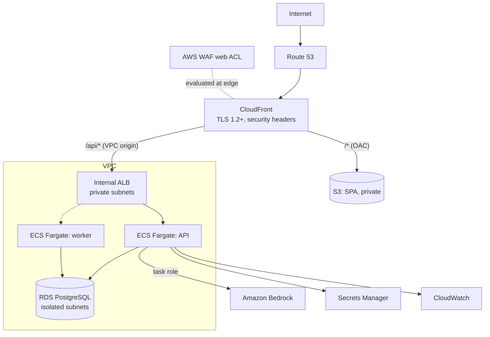

# SentinelEdge

An AI-assisted application, API, and edge security platform, built to show how an internet-facing,
AI-enabled application is designed, secured, deployed, monitored, and governed on AWS.

SentinelEdge is its own first protected workload. Every control it reports on also protects it.

> **Current status: Phases 1, 2, 6, 7 and 8 complete (v0.5.0): application security scanning.**
> Authentication with MFA, role-based access control, a tamper-evident audit log, rate limiting,
> an API Security Center, attack detection, correlation, an incident workflow with tamper-evident
> evidence, a security dashboard and a labelled attack simulator run locally, and now SAST, SCA,
> secrets, IaC, container and authenticated DAST scanning behind a fail-closed gate, SBOMs, and
> vulnerability management with SLAs and risk acceptance. **No AWS resources exist yet**: AWS phases are deliberately grouped late
> to keep cloud costs down ([ADR-0016](docs/adr/0016-local-first-phase-order.md)). Every
> capability is labelled REAL_AWS, LOCAL, SIMULATED, or DEMO in the UI, the API, and the docs,
> and tests enforce those labels. See [docs/feature-classification.md](docs/feature-classification.md).

## Contents

[Overview](#overview) · [Architecture](#architecture) · [Threat model](#threat-model) ·
[Security controls](#security-controls) · [Quick start](#quick-start) · [Security testing](#security-testing) ·
[Roadmap](#roadmap) · [Documentation](#documentation)

## Overview

| Area | What SentinelEdge demonstrates | Phase |
|---|---|---|
| Edge and WAF | CloudFront with a private VPC origin, AWS WAF managed, custom, and rate-based rules, changes through Terraform | 5 |
| API security | Authentication, RBAC, object-level authorization, OWASP API Top 10 mapping, rate limiting | 2, 6 |
| Threat modeling | STRIDE per trust boundary today; PASTA and in-app modeling later | 1, 10 |
| Security testing | Negative tests for every control; SAST, SCA, secrets, IaC, container, DAST in CI | 1, 8 |
| Certificates | ACM lifecycle, expiry monitoring and alerting | 5 |
| Detection and incident response | Detect-only HTTP attack analysis, correlation rules, DETECTED → CLOSED workflow with tamper-evident evidence; AI-assisted analysis later | 7, 9 |
| AI security | Amazon Bedrock analysis with prompt-injection defenses and human approval | 9 |
| Governance | Control matrix, exceptions with expiry, change management, audit trail | 2, 10 |
| Automation | Security CLI tools, GitHub Actions gates, Terraform | 3, 11 |

## Architecture



Design highlights:

- **No public origin.** The ALB is internal and reached only through CloudFront VPC origins, so the
  WAF cannot be bypassed by finding the origin ([ADR-0001](docs/adr/0001-private-origin-cloudfront-vpc-origin.md)).
- **One origin, no CORS.** SPA and API share a hostname ([ADR-0002](docs/adr/0002-single-origin-routing.md)).
- **Amazon Bedrock** for AI, authenticated by IAM task role — no AI API key exists to leak
  ([ADR-0006](docs/adr/0006-amazon-bedrock-ai-provider.md)). AI output is advisory and
  schema-bound; actions need human approval ([ADR-0007](docs/adr/0007-ai-output-contract-and-approval.md)).
- **WAF changes go through Terraform**, never from the internet-facing app
  ([ADR-0008](docs/adr/0008-waf-changes-via-terraform.md)).

Full detail: [docs/architecture.md](docs/architecture.md).

## Threat model

STRIDE per trust boundary (internet → edge → origin → API → database, plus AI, CI/CD, and operator
paths), mapped to the OWASP Top 10, API Security Top 10, and LLM Top 10. Each threat carries a
risk rating, controls, and a status of *Mitigated*, *Planned (phase)*, or *Accepted (interim)*.
See [docs/threat-model.md](docs/threat-model.md).

## Security controls

Seventeen defense-in-depth layers, from DNS to AI security, each with a stated reason, are mapped
requirement → threat → control → implementation → evidence in
[docs/security-controls.md](docs/security-controls.md).

**In place after Phase 7 (LOCAL, plus labelled SIMULATED):**

- **Security events and detection:** append-only events from authentication, authorization,
  rate limiting and 17 detect-only HTTP attack rules; seven correlation rules (credential
  stuffing, password guessing, injection campaigns, authorization probing, API abuse, scanning,
  sign-in from a stuffing source) run synchronously and exactly once
  ([ADR-0018](docs/adr/0018-security-event-pipeline-and-incidents.md)).
- **Incidents:** DETECTED → TRIAGED → INVESTIGATING → CONTAINMENT → REMEDIATION → VALIDATION →
  CLOSED, with role rules enforced on the server, write-once evidence links, and every timeline
  entry's digest committed to the audit chain and verified on read.
- **Security dashboard:** incidents, events, top sources and traffic, in a live view and a
  simulated view that are never mixed. Application inventory with owners and criticality.
- **Attack simulator (SIMULATED):** 11 scenarios built in memory, with no network traffic and no
  target input, through the real detection rules and a simulated WAF with AWS block and count
  semantics ([ADR-0019](docs/adr/0019-attack-simulator-and-simulated-waf.md)).

**In place since Phase 6 (LOCAL):**

- **Rate limiting:** PostgreSQL token buckets per IP (before authentication) and per account
  (after), 429 with Retry-After, first denial audited ([ADR-0017](docs/adr/0017-rate-limiting-and-client-ip.md)).
- **API Security Center:** every endpoint with authentication, authorization, risk, rate limit,
  24-hour traffic, error rate and security rejections, generated from the live route table;
  OWASP API Top 10 coverage with cited test evidence ([docs/api-security.md](docs/api-security.md)).
- **Trusted client IPs:** `X-Forwarded-For` honoured only from the proxy network; spoofing is
  ignored and audit records name the real client.
- **SSRF guard** ready for future outbound calls; route-table sweeps against mass assignment and
  excessive data exposure.

**In place since Phase 2 (LOCAL):**

- **Authentication:** Argon2id, 15-minute JWTs checked against a live session on every request,
  rotating refresh tokens in a `__Host-` HttpOnly cookie with theft detection, TOTP MFA with
  recovery codes (mandatory for privileged roles), lockout, and enumeration-resistant errors.
- **No default credentials:** the first admin gets a one-time password from the CLI; everyone
  else is invited by one-time link. Admins never see or set anyone's password.
- **Authorization:** five roles; every route declares its access and a test sweeps every route as
  every role ([docs/authorization.md](docs/authorization.md)). Object-level checks on user records.
- **Audit log:** hash-chained and append-only by grant *and* trigger; tampering is detected at the
  exact record. Viewable and verifiable in the UI by admins and security engineers.
- **Database least privilege:** the API connects as a role that cannot change schema or rewrite
  history; a privilege-matrix test guards every grant ([ADR-0015](docs/adr/0015-database-roles-and-migrations.md)).

**In place since Phase 1:**

- Security headers on every API response, including errors and rejected hosts. Strict SPA CSP with
  no inline script or style.
- Error responses that never expose stack traces, internal paths, or submitted input, each with a
  correlation ID for investigation.
- Structured JSON logs with recursive secret redaction and log-injection neutralisation.
- Host header allow-list. Interactive API docs forced off in deployed environments.
- Hash-pinned Python dependencies, lockfile-pinned npm dependencies, SHA-pinned CI actions,
  read-only CI token.
- Hardened containers: non-root, read-only filesystem, all capabilities dropped,
  no-new-privileges. Local database on an internal-only network.
- Gitleaks, Ruff security rules, Bandit, mypy strict, pip-audit, npm audit, and ESLint rules that
  ban `dangerouslySetInnerHTML`, `innerHTML`, `eval`, and web storage — run in pre-commit and CI.
- A capability register with tests that stop anything being labelled as a real AWS control
  before it is one.

## Quick start

Requirements: Docker with Compose v2, Python 3.12+, Node 22+, Make, OpenSSL.

```bash
make env                                  # .env with random local secrets (mode 600)
make dev                                  # web on http://localhost:8080
make create-admin EMAIL=you@example.com   # one-time password; you'll set your own + MFA
make check                                # lint, types, tests, SAST, SCA — the CI gates
make smoke                                # end-to-end test of the running stack (48 checks)
```

More in [docs/local-development.md](docs/local-development.md).

## Security testing

| Suite | What it proves |
|---|---|
| `backend/tests/security/test_security_headers.py` | Headers present on 200, 400, 404, and 500 responses |
| `backend/tests/security/test_error_handling.py` | No secrets, paths, tracebacks, or reflected input in errors; extra fields rejected |
| `backend/tests/security/test_correlation_id.py` | Hostile request IDs are replaced, not logged or echoed |
| `backend/tests/security/test_trusted_host.py` | Unexpected Host headers are rejected |
| `backend/tests/unit/test_config.py` | Insecure configuration is refused or overridden |
| `backend/tests/unit/test_capabilities.py` | Simulated features cannot be labelled real |
| `backend/tests/security/test_authz_matrix.py` | Every route's access is declared and enforced, for every role |
| `backend/tests/integration/test_auth_login.py` | Uniform failures, lockout, forged JWTs (alg none, substitution, wrong key), CSRF |
| `backend/tests/integration/test_auth_sessions.py` | Refresh rotation; a replayed token kills the session |
| `backend/tests/integration/test_auth_mfa.py` | TOTP replay, brute force, encrypted secrets, single-use recovery codes |
| `backend/tests/integration/test_audit_log.py` | Grants and triggers block edits; tampering detected at the exact record |
| `backend/tests/integration/test_database_roles.py` | The app role has exactly its intended privileges |
| `backend/tests/integration/test_correlation.py` | Detections fire at threshold, once, never across provenance (30 concurrent writers) |
| `backend/tests/integration/test_incidents.py` | Workflow and role rules, stale writes refused, timeline tampering detected |
| `backend/tests/integration/test_simulator.py` | Simulations take no target, stay SIMULATED, and never reach the live view |
| `backend/tests/unit/test_http_analysis_performance.py` | Detection patterns stay linear on adversarial input (no ReDoS) |
| `backend/tests/unit/test_scanning.py` | The gate blocks fixable critical/high, honours unexpired acceptances, and fails closed on missing reports |
| `backend/tests/integration/test_vulnerabilities.py` | Findings de-duplicate, are fixed only by covering scans, reopen; acceptances expire; developers see only their own; the record cannot be rewritten |
| `backend/tests/unit/test_frontend_contract.py` | The SPA's allowed values match every backend enumeration |
| `scanning/semgrep/` (`make scan-test`) | Each SentinelEdge Semgrep rule flags its bad examples and none of the good ones |
| `make scan`, `make dast` | Semgrep, Bandit, Trivy, Gitleaks, Checkov, Syft and authenticated ZAP behind the gate |
| `frontend/src/features/secops/secops.test.tsx` | Pages render the server's permissions; attack snippets render as text, never markup |
| `frontend/src/features/appsec/appsec.test.tsx` | Scanner text renders as text; only https references are links; the server's allowed moves only |
| `frontend/src/lib/auth/session.test.ts` | Token stays in memory; one refresh and one retry; concurrent refreshes share one call |
| `frontend/src/lib/api/client.test.ts` | Client refuses cross-origin paths and redirects, and validates responses |
| `scripts/smoke-auth.py` (`make smoke`) | The whole journey against the running stack |

The test suites found and fixed two real bugs during Phase 2: Unicode digits slipping past MFA
code validation, and a role comparison that could never match. Both have regression tests.

Attack simulations (Phase 7) and DAST scans (Phase 8) target only SentinelEdge itself, never
external systems.

## Roadmap

Listed in build order. Phase numbers keep their original meaning; the order defers every AWS
resource until the local work is done ([ADR-0016](docs/adr/0016-local-first-phase-order.md)).

| Phase | Scope | Status |
|---|---|---|
| 1 | Architecture, repository, ADRs, local environment, CI baseline | **Complete** (v0.1.0) |
| 2 | Secure application foundation: auth, MFA, RBAC, audit logging | **Complete** (v0.2.0) |
| 6 | API security: inventory, OWASP API mapping, rate limiting | **Complete** (v0.3.0) |
| 7 | Security operations: events, dashboard, incidents, simulator, application inventory | **Complete** (v0.4.0) |
| 8 | Application security scanning, SBOM, vulnerability management | **Complete** (v0.5.0) |
| 10 | Threat modeling and governance | Next |
| 9 | AI security engine on Amazon Bedrock | Planned |
| 3 | Terraform AWS foundation: VPC, security groups, IAM, ECR, state | Planned |
| 4 | AWS deployment: ECS, internal ALB, RDS, Secrets Manager, CloudWatch | Planned |
| 5 | CloudFront, AWS WAF, ACM/TLS, Route 53, edge headers | Planned |
| 11 | Automation and full DevSecOps pipeline | Planned |
| 12 | Hardening, final assessment, interview demo | Planned |

AWS cost so far: $0. The AWS phases run as one deployment window, then deploy–demo–destroy.

## Documentation

Index: [docs/README.md](docs/README.md). Decisions: [docs/adr/](docs/adr/). Security
lifecycle: [docs/secure-sdlc.md](docs/secure-sdlc.md). Vulnerability reporting:
[SECURITY.md](SECURITY.md).

Lessons learned and future improvements are recorded as phases complete.

## Data

All data is synthetic. Do not load real credentials, personal data, or customer information.
